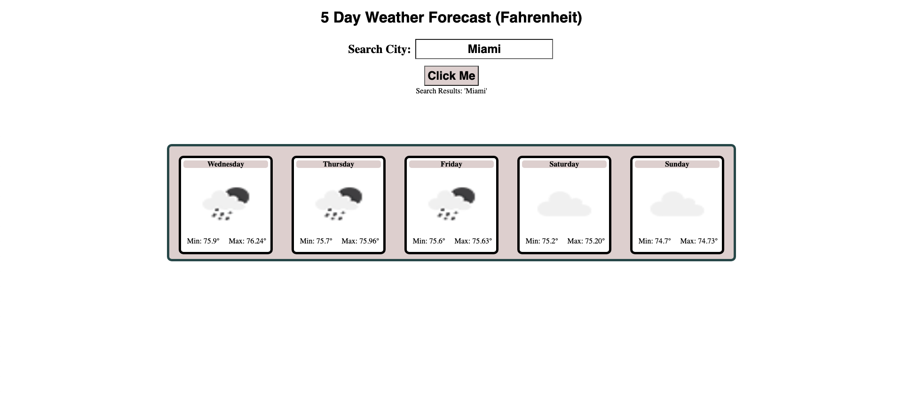

# Challenge6 Weather Dashboard Cook

Project Page: [Project Page](https://timothymichaelcook.github.io/challenge6-weather-dashboard-cook/)

Project Repo: [Github-pages](https://github.com/timothymichaelcook/challenge6-weather-dashboard-cook)

## Description

The focus of this project was to get weather data using the OpenWeather API, with local storage being used to store data.
This webpage will take a user's input in the form of text, make a call to the open weather API and return the five day weather forecast for that city. The page displays the user's search results, days of week, descriptive weather icons and minumnim/maximum values for temperatures in fahrenheit.

## User Story

```
- AS AN an adventure guide 
- I WANT to generate weather reports
- SO THAT I can schedule safe trips
```

## Installation

N/A

## Usage

Users need to click the text field, enter a given city and click the button. The webpage will generate a section with the weather for the last 5 days.


## Credits

N/A

## License

MIT License

## Screenshots




## Contact
Timothy Cook - timothy.michael.cook@gmail.com
