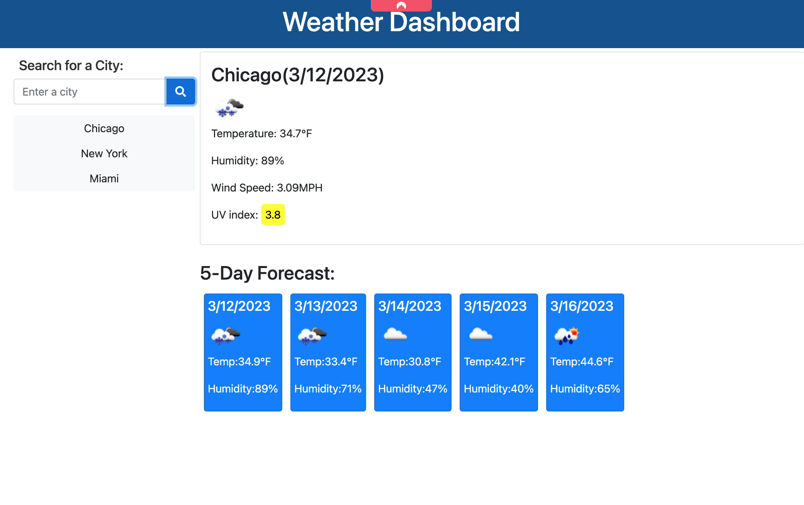

# Weather Dashboard

Project Page: [Project Page](https://timothymichaelcook.github.io/6-weather-dashboard-cook)

Project Repo: [Github-pages](https://github.com/timothymichaelcook/6-weather-dashboard-cook)


## Description

The focus of this project was to get weather data using the OpenWeather API, with local storage being used to store data.
This webpage will take a user's input in the form of text, make a call to the open weather API and return the five day weather forecast for that city. 
The page displays the user's search results, days of week, descriptive weather icons, minimum/maximum values for temperature in fahrenheit, and previous searched cities below user input element.

## User Story

```
- AS A traveler
- I WANT to see the weather outlook for multiple cities
- SO THAT I can plan a trip accordingly
```

## Installation

N/A

## Usage

Users need to click the text field, enter a given city and click the button. The webpage will generate two sections, the current weather of selected city and the weather for the last 5 days.

## Credits

University of Richmond Coding Bootcamp

## License

MIT License

## Screenshots





## Contact
Timothy Cook - timothy.michael.cook@gmail.com
